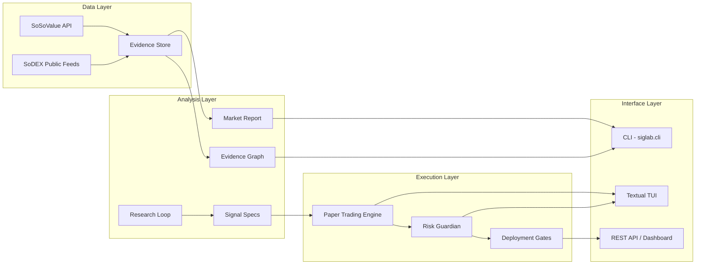

# SigLab

[](https://www.python.org/downloads/release/python-3120/)
[](LICENSE)
[](https://github.com/sosovalue/siglab)
[](siglab/cli)

Research-to-action prototype for a one-person on-chain finance operator. Ingests SoSoValue evidence, links it with SoDEX market context, runs bounded strategy research loops, and emits operator-facing reports.

---

## Table of Contents

- [Architecture](#architecture)
- [Why Terminal-First?](#why-terminal-first)
- [Quick Start](#quick-start)
- [How It Works](#how-it-works)
- [Quick Demo](#quick-demo)
- [Example Output](#example-output)
- [Core Commands](#core-commands)
- [Paper Trading](#paper-trading)
- [Terminal UI (TUI)](#terminal-ui-tui)
- [Screenshots](#screenshots)
- [What Is Real Now](#what-is-real-now)
- [What Is Not Real Yet](#what-is-not-real-yet)
- [Validation](#validation)
- [License](#license)

---

## Architecture



**Clean Architecture layers:** Domain Entities (`data/`) → Use Cases (`live/`, `evaluation/`) → Adapters (`risk/`, `dashboard/`) → Drivers (`cli/`, `tui/`).

---

## Why Terminal-First?

One-person ops don't need a web dashboard for every task. The terminal is the fastest path from data to decision — pipe JSON outputs into `jq`, script multi-step research with shell one-liners, and keep the full context in tmux splits. SigLab's CLI gives you **instant feedback**, **composable commands**, and **zero context-switching** into a browser. When you do need visuals, the Textual TUI and HTML report export are one flag away.

---

## Quick Start

```bash
pip install -e .
cp .env.example .env
```

Configure secrets locally — do not commit them:
- **SoSoValue API key**: `config.json` or `SOSOVALUE_API_KEY`
- **B.AI provider config**: `.siglab-provider.env`
- **SoDEX signer config**: only for signed-path validation

---

## How It Works

1. **Evidence** — `evidence-build` fetches verified SoSoValue API data (news, ETF flows, currency listings)
2. **Market context** — `sodex-ws-probe` pulls public SoDEX market data (klines, orderbook, tickers)
3. **Research loop** — `run` triggers planner/writer/reflector stages to generate and evaluate signal specs
4. **Report** — `market-report` merges evidence with market context into operator-facing reports
5. **Act** — paper trading simulates positions; risk guardian monitors portfolio exposure

---

## Quick Demo

Run the full judge-facing demo pipeline in one command (preflight → manifest → market report → telemetry):

```bash
python3 -m siglab.cli demo run --json
```

This chains the full proof-of-value: public SoDEX readiness, artifact indexing, market report generation, and provider telemetry — all emitted as a single JSON payload.

---

## Example Output

### Market Report (JSON)

```json
{
  "entity": "BTC",
  "status": "READY_FOR_OPERATOR_REVIEW",
  "signal_summary": {
    "headline": "BTC: ETF inflow; SoDEX quote bid=67432.10 ask=67435.50; news_items=5; live_write_allowed=false",
    "flow_direction": "ETF inflow",
    "flow_value": 284700000.0,
    "operator_action": "review_only_signed_execution_blocked",
    "causality": "not_claimed"
  },
  "evidence_selection": {
    "sosovalue_rows_read": 142,
    "sodex_rows_read": 89
  }
}
```

### Demo Run Summary

```
preflight: public_read=True signed=False live_write=False |
manifest: readiness=4 of 7 artifacts=10 |
market: entity=BTC status=READY_FOR_OPERATOR_REVIEW warnings=2 |
telemetry: traces=12 tools=34 providers=ok
```

---

## Core Commands

```bash
# Build SoSoValue evidence
python3 -m siglab.cli evidence-build --currency BTC --json

# Research loop (deterministic, no LLM)
python3 -m siglab.cli run --track trend_signals --skip-llm --iterations 1

# B.AI-backed loop with credit limits
python3 -m siglab.cli run --track trend_signals --iterations 1 \
  --max-total-credits 6000 --agent-label demo

# Operator market report
python3 -m siglab.cli market-report --entity BTC --json

# Validate boundaries
python3 -m siglab.cli sodex-preflight --json
python3 -m siglab.cli valuechain-preflight --json

# Demo pipeline
python3 -m siglab.cli demo run --json
python3 -m siglab.cli demo manifest --json

# Telemetry
python3 -m siglab.cli telemetry-report --track trend_signals --json
```

---

## Paper Trading

```bash
python3 -m siglab.cli paper-start --session my-first-paper
python3 -m siglab.cli paper-status --session <id>
python3 -m siglab.cli paper-promote --session <id>
```

Promotion engine gates eligibility via composite score (Sharpe, win rate, consistency). Reconciliation validates backtest vs paper PnL alignment.

---

## Terminal UI (TUI)

Textual+Rich terminal app at `siglab/tui/`:

| Screen | Features |
|---|---|
| Market Overview | Symbol search, sparkline klines, ticker table, order book depth |
| Paper Trading | Positions, order form (MARKET/LIMIT), order history, PnL chart |
| Risk Monitoring | Composite score gauge, drawdown, correlation heatmap, alerts |
| Strategy Research | Strategy list, results table, multi-select comparison |
| Telemetry Browser | Run list with filters, provider metrics, tool usage |
| Evidence & Demo | Evidence graph, 8-step interactive demo walkthrough |

```bash
python3 -m siglab.cli tui
```

---

## Screenshots

> *Screenshots coming soon — run `siglab.cli demo run --json` and `siglab.cli market-report --entity BTC --html-output report.html` to generate your own.*

| Demo Panel | Market Report | Terminal Summary |
|---|---|---|
|  |  |  |

---

## What Is Real Now

- **SoSoValue API**: currencies, news, ETF data — real endpoints with retry/error classification
- **SoDEX public context**: REST perp data + WebSocket feeds
- **Paper trading engine**: MARKET/LIMIT order lifecycle, funding simulation, session persistence
- **Risk Guardian**: composite scoring, drawdown, correlation, concentration alerts
- **Research loop**: planner/writer/reflector orchestration with lineage tracking
- **TUI**: Textual terminal app with 6 screens (market, paper, risk, strategy, telemetry, evidence)
- **CLI**: modular commands with Rich formatting
- **2608+ tests** across unit, integration, and golden-file regression

---

## What Is Not Real Yet

- Full SoSoValue coverage (Index, Macro, Crypto Stocks, Fundraising, Analysis Charts)
- Live signed SoDEX execution
- Private/account SoDEX WebSocket streams
- SSI/Index on-chain integration
- USD cost enforcement for B.AI (credits tracked, not dollars)

---

## Validation

```bash
python3 -m pytest -q
python3 -m siglab.cli profile --strict --json
```

Current: 2608+ tests passing, strict profile has zero findings. Signed SoDEX validation requires credentials.

---

## License

MIT
